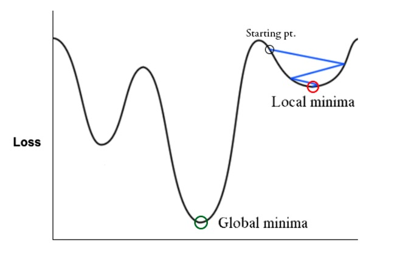
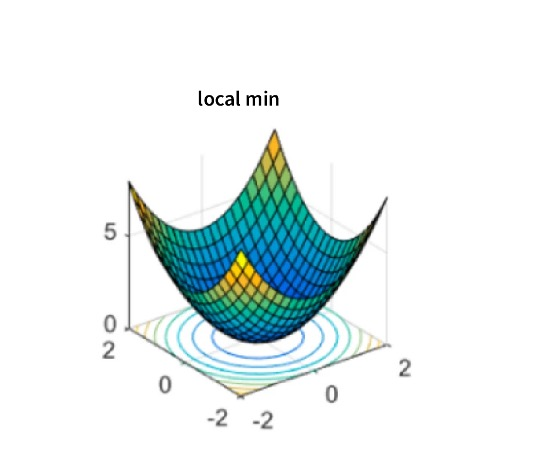
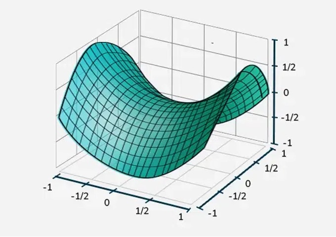
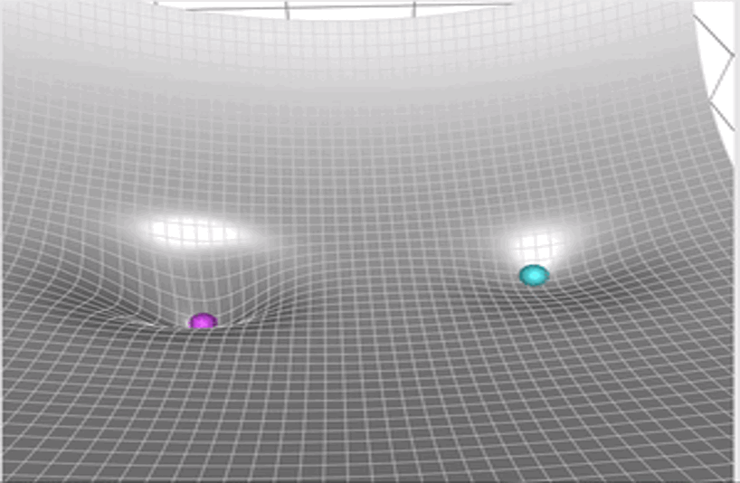
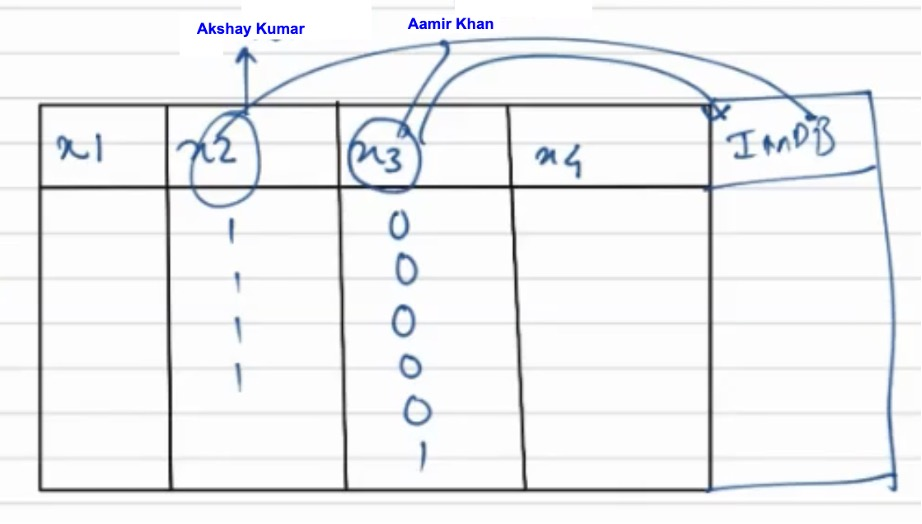
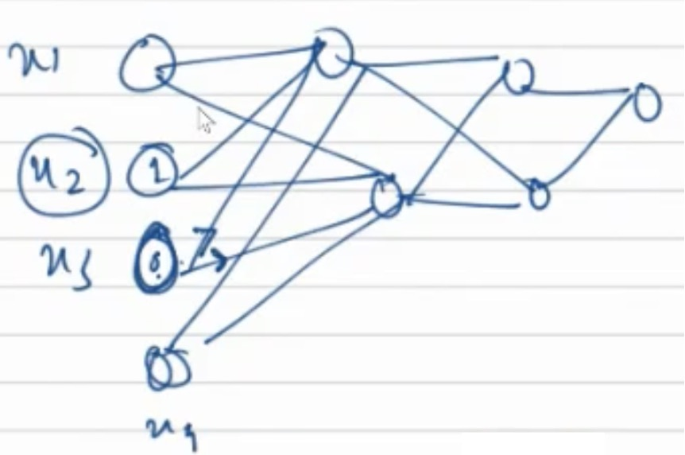

## Optimizers

### 🔸 Gradient Descent

Also known as **Batch Gradient Descent**.

- Gradient Descent uses only the current gradient (point gradient).

**Update Rule:**

$$
w_{t+1} = w_t - \alpha \cdot \frac{dL}{dw_t}
$$

Where:  

$w_t$ → weight at time step $t$  
$\alpha$ → learning rate  
$\frac{dL}{dw_t}$ → gradient of the loss function w.r.t. $w_t$  
$w_{t+1}$ → updated weight for the next iteration

#### Major problem of Gradient Descent approach - 
Can’t reach global minima

- Getting stuck in local minima -

- Saddle points : Minima in one direction but maxima in another direction.

Different **Optimizers** help to reach the global minima of loss curve with higher probability.

### 🔸 Momentum based Gradient Descent

Momentum based Gradient Descent uses both historical and current gradient info.

**Update Rule:**

$$
w_{t+1} = w_t - m_t
$$

$$
m_t = \gamma \cdot m_{t-1} + (1 - \gamma) \cdot \frac{dL}{dw_t}
$$

Where:

$w_{t+1}$ → updated weight for the next iteration
$w_t$  → weight at time step $t$  
$m_t$ → momentum at step $t$  
$\gamma$ → momentum coefficient (e.g., 0.9)  
$m_{t-1}$ → momentum from the previous step  
$\frac{dL}{dw_t}$ → gradient of the loss function with respect to $w_t$  

$\gamma$ here is a hyperparameter.

$m_t$ is an accumulator variable.

  

> 👉 Click the image to view the animation.

Orange ball → Momentum based GD  
Blue ball → Vanilla GD

Note that momentum based GD takes more time or more oscillations to settle down than vanilla GD because of the “history” it carries.

### 🔸 Adaptive Gradient (Adagrad)

Let’s consider the below 2 scenarios -

[ Scenario 1 ]

Ex: Akshay Kumar creates movies more frequently than Aamir Khan, however the movies created by Aamir Khan have a very high impact on the IMDB ratings.

Weights associated with feature $x_3$ will not have equal opportunity to get trained as much as $x_2$.
Hence, sparse features won’t get sufficient opportunity to get trained.
