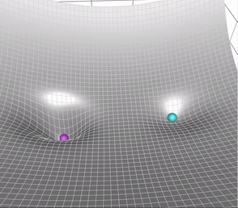

## Optimizers

### 🔸 Gradient Descent

Also known as **Batch Gradient Descent**.

- Gradient Descent uses only the current gradient (point gradient).

**Update Rule:**

$$
w_{t+1} = w_t - \alpha \cdot \frac{dL}{dw_t}
$$

Where:  

$w_t$ → weight at time step $t$  
$\alpha$ → learning rate  
$\frac{dL}{dw_t}$ → gradient of the loss function w.r.t. $w_t$  
$w_{t+1}$ → updated weight for the next iteration

#### Major problem of Gradient Descent approach - 
Can’t reach global minima

- Getting stuck in local minima -

- Saddle points : Minima in one direction but maxima in another direction.

Different **Optimizers** help to reach the global minima of loss curve with higher probability.

### 🔸 Momentum based Gradient Descent

Momentum based Gradient Descent uses both historical and current gradient info.

**Update Rule:**

$$
w_{t+1} = w_t - m_t
$$

$$
m_t = \gamma \cdot m_{t-1} + (1 - \gamma) \cdot \frac{dL}{dw_t}
$$

Where:

$w_{t+1}$ → updated weight for the next iteration
$w_t$  → weight at time step $t$  
$m_t$ → momentum at step $t$  
$\gamma$ → momentum coefficient (e.g., 0.9)  
$m_{t-1}$ → momentum from the previous step  
$\frac{dL}{dw_t}$ → gradient of the loss function with respect to $w_t$  

$\gamma$ here is a hyperparameter.

$m_t$ is an accumulator variable.

  

> 👉 Click the image to view the animation.

Orange ball → Momentum based GD  
Blue ball → Vanilla GD

Note that momentum based GD takes more time or more oscillations to settle down than vanilla GD because of the “history” it carries.

### 🔸 Adagrad (Adaptive Gradient)

Let’s consider the below 2 scenarios -

[ Scenario 1 ]

Ex: Akshay Kumar creates movies more frequently than Aamir Khan, however the movies created by Aamir Khan have a very high impact on the IMDB ratings.

Weights associated with feature $x_3$ will not have equal opportunity to get trained as much as $x_2$.
Hence, sparse features won’t get sufficient opportunity to get trained.

[ Scenario 2 ]

Weights are randomly initialized due to which some weights may be closer to the minima while others may be too far. Training them for the same number of epochs would not be the right way.

**Update Rule:**

$$
w_{t+1} = w_t - \frac{\alpha}{\sqrt{v_t + \epsilon}} \cdot \frac{dL}{dw_t}
$$

$$
v_t = v_{t-1} + \left( \frac{dL}{dw_t} \right)^2
$$

Where:

$w_{t+1}$ → updated weight for the next iteration  
$w_t$ → weight at time step $t$  
$\alpha$ → initial learning rate  
$v_t$ → sum of squares of past gradients up to time $t$  
$v_{t-1}$ → sum of squares of past gradients up to time $t - 1$  
$\epsilon$ → small constant to prevent division by zero (e.g., $10^{-8}$)  
$\frac{dL}{dw_t}$ → gradient of the loss function with respect to $w_t$

**Notes:**

- This accumulates the squared gradients over time.  
- Used in the denominator → adapts the learning rate per parameter.  
- If a parameter has large past gradients, $v_t$ becomes large → its learning rate becomes small, and vice versa.  

⚠️ **Downside of Adagrad:** The learning rate keeps shrinking over time → may stop learning too early.

### 🔸 RMSprop (Root Mean Squared Propagation)

- Fixes AdaGrad’s problem of rapidly decreasing learning rates.

**Update Rule:**

$$
w_{t+1} = w_t - \frac{\alpha}{\sqrt{v_t + \epsilon}} \cdot \frac{dL}{dw_t}
$$

$$
v_t = \beta \cdot v_{t-1} + (1 - \beta) \cdot \left( \frac{dL}{dw_t} \right)^2
$$

Where:

$w_{t+1}$ → updated weight for the next iteration  
$w_t$ → weight at time step $t$  
$\alpha$ → learning rate  
$v_t$ → exponentially decaying average of past squared gradients  
$v_{t-1}$ → moving average from previous step  
$\beta$ → decay rate (e.g., 0.9)  
$\epsilon$ → small constant to avoid division by zero (e.g., $10^{-8}$)  
$\frac{dL}{dw_t}$ → gradient of the loss function with respect to $w_t$ 

### 🔸 Adam (Adaptive Moment Estimation)

- Adam = RMSprop + Momentum

**Update Rule:**

$$
w_{t+1} = w_t - \frac{\alpha}{\sqrt{\{v}_t} + \epsilon} \cdot \{m}_t
$$

With:

$$
m_t = \beta_1 \cdot m_{t-1} + (1 - \beta_1) \cdot \frac{dL}{dw_t}
$$

$$
v_t = \beta_2 \cdot v_{t-1} + (1 - \beta_2) \cdot \left( \frac{dL}{dw_t} \right)^2
$$

Where:

$w_{t+1}$ → updated weight for the next iteration  
$w_t$ → weight at time step $t$  
$\alpha$ → learning rate  
$m_t$ → momentum  
$v_t$ → velocity  
$\beta_1$ → decay rate for the momentum (e.g., 0.9)  
$\beta_2$ → decay rate for the velocity (e.g., 0.999)  
$\epsilon$ → small constant to prevent division by zero (e.g., $10^{-8}$)  
$\frac{dL}{dw_t}$ → gradient of the loss function with respect to $w_t$  

**Notes:**

- Combines **momentum** ($m_t$) and **RMSprop-style scaling** ($v_t$).  
- Uses **bias correction** to account for initial values being zero.  
- Works well in practice and is widely used in deep learning.  
- ⚡ Fast convergence, robust to noisy gradients and sparse data.

